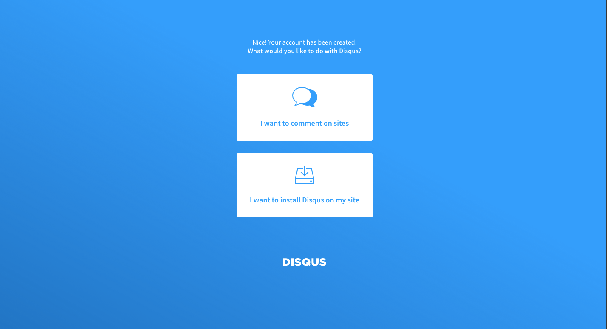
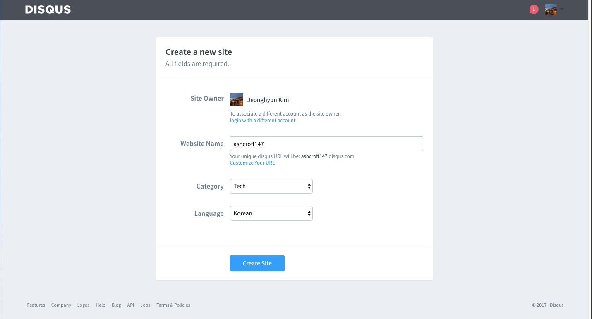
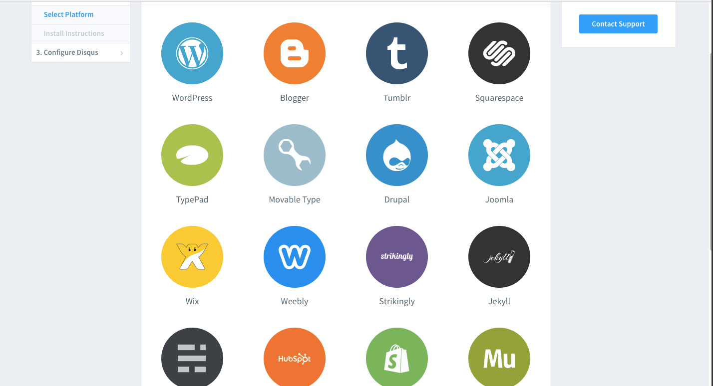
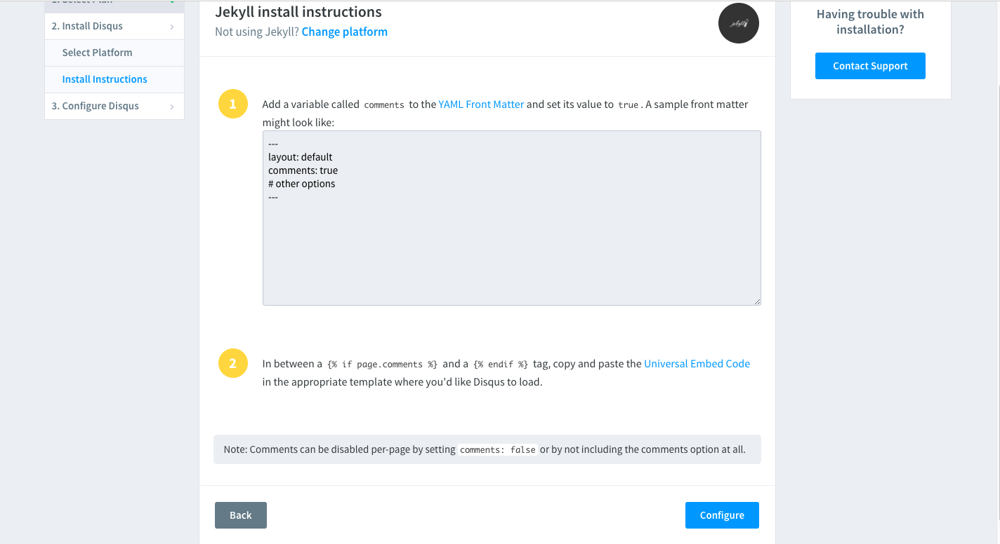
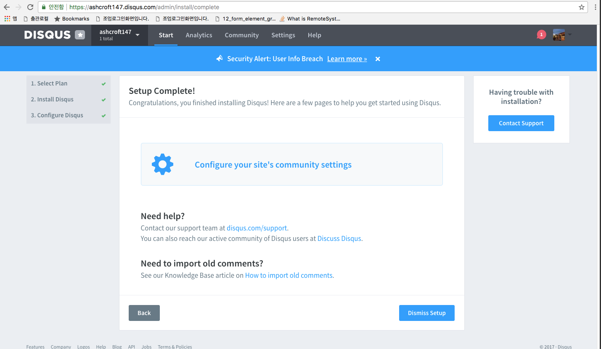

## Disqus 설정

## YAML Front Matter 에 변수 추가

## Universal Embed Code 붙이기

## disqus.html 파일 포함하기

## TroubleShooting

### We were unable to load Disqus. If you are a moderator please see our troubleshooting guide.
var disqus_shortname = '{{ site.disqus }}';
