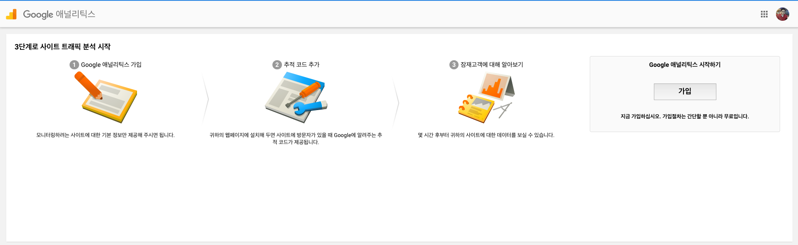
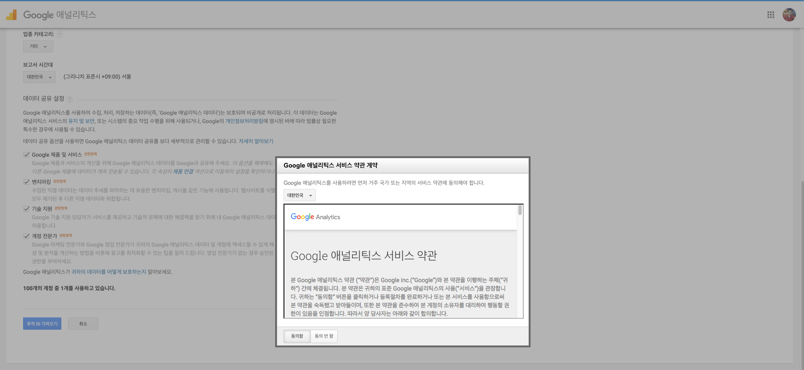
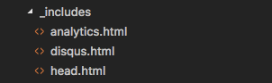

## Google Analytics 란 ?

Google Analytics은 website에 유입되는 web traffic을 분석하기 위해 사용하는 툴이다.

사용자가 어디로부터 유입이 되었는지,
사용자가 얼마나 오랫동안 웹사이트에 머물렀는지, 
사용자가 어떤 페이지를 방문했는지, 
웹사이트의 퍼포먼스는 어떤지에 대한 정보등 기타 다양한 정보를 대쉬보드 형태로 제공한다. 

이번 포스트를 통해서는 Jekyll에 Google Analystic을 연동하는 방법을 설명하고자 한다. 

## Google Analytics 가입
Google Analytics는 계정을 생성하여 추적하고자 하는 웹사이트의 정보를 셋업하면 된다. 가입은 [Google 애널리틱스](https://analytics.google.com/analytics/web/?authuser=0#provision/SignUp/) 홈페이지를 통해서 진행한다. 

- 가입 클릭

- 웹사이트 정보 입력 및 약관 동의

## 추적코드(tracking code) 확인
추적코드는 Javascript 코드 조각으로써 사용자 분석이 필요한 웹사이트에 추가하면 된다. 
추적코드는 Admin > Property > Traking Info > Tracking Code 의 경로를 통해서 다시 조회가능 하다.

## Jekyll 에 추적코드 추가하기
포스트로 작성하는 모든 글들이 추적대상이므로 모든 포스트 작성시마다 추적코드가 필요하긴 하지만 추적코드가 포함된 html 파일을 _includes 폴더 밑에 생성한다.  

- _include/analytics.html
~~~
<!-- Global site tag (gtag.js) - Google Analytics -->

~~~

그리고 _layouts 폴더 밑의 default.html 파일의 body end tag 바로 앞에 analytics.html 파일을 포함시킨다.

- _layouts/default.html
~~~
   ...
    <footer>
      
        &copy; <time datetime="{{ site.time }}">{{ site.time | date: '%Y' }}</time> {{ site.author.name }}. Made with Jekyll using the <a href="https://github.com/chesterhow/tale/">Tale</a> theme.
      
    </footer>
    
  </body>
~~~

위와같이 템플릿을 생성하면 새로운 포스트를 작성할 때마다 자동으로 추적코드가 추가될 것이다.
이제부터 모든 포스트가 Google Analytics에 의해 사용자 분석이 시작될 것이다.

## 참고자료
 - [Google Analytics setup for Jekyll](https://michaelsoolee.com/google-analytics-jekyll/)