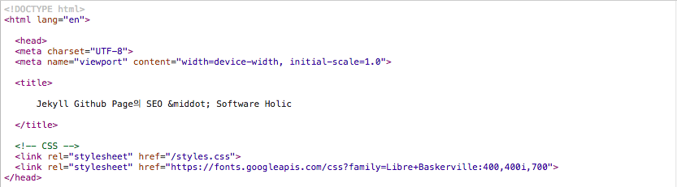
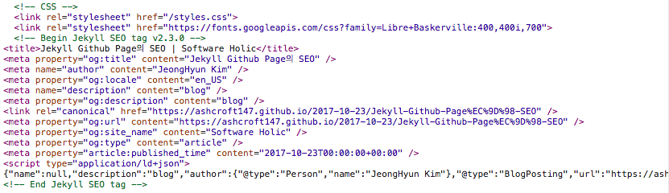

지금부터 검색엔진 및 SNS를 통해 Jekyll로 포스트 되는 블로그가 더욱 잘 검색될 수 있도록 도와주는 SEO Tag에 대해서 알아보자.

## Jekyll SEO Tag 설치
1. root 폴더에 위치한 _config.yml 에 다음의 plugin 사용을 위한 구문을 정의한다. 

~~~
plugins:
  - jekyll-seo-tag
~~~

2. </head> tag 바로 이전에 다음 구문을 추가한다. 나의 경우에는 _includes/head.html에 다음과 같이 정의했다.

~~~
<head>
  ..
  <link rel="stylesheet" href="https://fonts.googleapis.com/css?family=Libre+Baskerville:400,400i,700">
  
</head>
~~~

위의 간단한 과정만으로 SEO Tag 사용을 위한 정의가 끝난다.

## Jekyll SEO Tag가 하는 일

우선 Jekyll SEO Tag의 설치 전과 후를 Chrome Dev Tool의 소스보기를 통해 비교해 보면,

- 설치 전

- 설치 후

한눈에 봐도 여러 종류의 meta tag들이 head tag 안에 추가된 것을 확인할 수 있다.
즉 SEO Tag 를 사용하면 meta 태그를 자동으로 생성해주면서 포스트가 검색엔진에 더욱 잘 노출될 수 있도록 도와주는 역할을 한다.  

### title

Site 제목이 추가된 형태로 포스트의 title 태그를 생성한다. 
title 태그는 검색엔진의 검색결과의 제목으로 표시되는 내용이다.
~~~
<title>Jekyll Github Page의 SEO | Software Holic</title>
~~~

### description

페이지에 대한 짧은 설명을 제공하는 태그로, 검색결과에 나타나는 Snippet 일부로 사용할 수 있다.
~~~
<meta name="description" content="blog" />
~~~

### Canonical URL

현재의 웹페이지에서 대표 url주소가 무엇인지를 정확히 검색엔진에 알려주는 역할을 수행한다.
 - [검색엔진 최적화 방법 - Canonical 태그의 중요성과 활용 방법](http://webisfree.com/2014-09-24/%EA%B2%80%EC%83%89%EC%97%94%EC%A7%84-%EC%B5%9C%EC%A0%81%ED%99%94-%EB%B0%A9%EB%B2%95-canonical-%ED%83%9C%EA%B7%B8%EC%9D%98-%EC%A4%91%EC%9A%94%EC%84%B1%EA%B3%BC-%ED%99%9C%EC%9A%A9-%EB%B0%A9%EB%B2%95) 참조

### Rich 인덱싱을 위한 JSON-LD Site

JSON-LD는 RDF 그래프와 데이터셋을 위한 JSON 구문을 제공함
  - JSON-LD는 최소한의 변화로 JSON 문서를 RDF로 변환하는데 사용됨
  - JSON-LD는 JSON 문서가 웹 상의 다른 위치에 있는 다른 JSON 문서에서 기술하고 있는 객체를 참조할 수 있는 메커니즘

### OG(Open Graph) title, description, site title

Facebook 에서 만든 Open Graph Protocol 은 각 웹페이지에서 meta 태그로 작성되어 웹페이지의 미리보기를
구성하는 정보입니다. 오픈그래프에 대한 상세한 참조는 [링크의 미리보기 제목, 설명, 이미지를 결정하는 open graph 태그]http://blog.ab180.co/open-graph-as-a-website-preview/ 및 [오픈그래프](http://ogp.me/) 공식 사이트에 상세히 설명되어 있다

## 참고자료

 - [GitHub Help](https://help.github.com/articles/search-engine-optimization-for-github-pages/)
