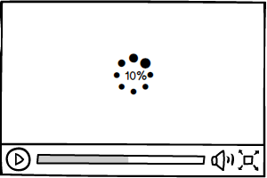
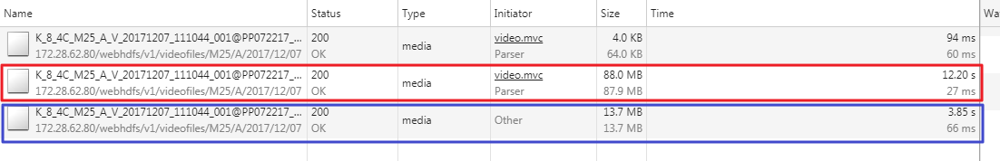

# video element의 event의 이해 및 download progress의 구현

지난해 중순 즈음에 오랫동안 몸담았던 팀을 옮기고 처음으로 수행한 프로젝트 관련해서 최종적으로 만들고자 했던 기능이 HDFS에 저장된 영상 파일의 Partial Request/Response, 그리고 Download Progress를 View에 update하는 기능이었는데 결국 마무리 짓지 못하였다. 
아쉬움이 남지만, 고민의 과정을 통해서 배운 몇가지를 정리해 두고자 한다. 

## Range Request

사실 처음 이 프로젝트를 시작했을 당시에는 Range Request란 것의 개념조차 알지 못한 상태 였다. 그러다가 브라우저에서 video 요소를 통해 처음 HDFS의 영상을 streaming 을 하게 되었을때, http request 이후 영상이 video player에서 재생되기까지 시간이 오래 걸리는 것을 확인하고 youtube는 어떻게 대용량의 파일에 대해서 서비스를 구현할까 고민하다가 처음으로 이 개념을 접하게 되었다. 

Range Request 란,
파일의 크기가 큰 미디어 파일의 경우 파일의 전체가 아닌 일부로 나누어 보낼 수 있는 기능을 의미한다. 

브라우저에서는 Request Header의 Range Field를 통해서 요청을 하게된다. 

> Range: bytes=0-100

또한 서버에서 Range Request를 지원해야 하며,

> Accept-Range: bytes

위 필드 값을 통해 웹서버가 Range Request를 지원하는지 알 수 있다. 

서버 응답 header에서 

> Content-Range: bytes=100-200/1024

필드 값을 통해서 미디어 파일의 전체 사이즈 및 다운로드 받는 영상의 범위를 알 수 있다. 
 - 전체 사이즈: 1024
 - 현재 수신받는 사이즈: 101(200 - 100 + 1)

이렇게 개괄적인 개념을 갖고, 
처음으로 고민한 것이 video 요소의 src 속성의 URL을 통해 영상 파일을 요청하게 되는데, 그렇다면 Request Header의 Range Field 값은 어떻게 끊어서 요청할 수 있는가 였다. 

얼마간의 검색과 고민 끝에 얻은 결론은 불가능 하다 였다. ([Http Range Header](https://stackoverflow.com/questions/3303029/http-range-header))
Range Field는 Browser를 통해서 결정되기 때문이다.

결국 byte range의 기능을 구현하기 위해서는 client의 range request의 portion을 지정하는 것을 포함하여 웹서버의 기능 구현이 필요한데, 여러가지 물리적인 한계에 의해서 해당 서버로직 구현이 불가능하여 byte range 기능의 구현은 이번 프로젝트에서는 포기해야만 했다. 

## Media 파일 download progress 기능의 구현

byte range 기능 구현을 하지 못하는 것을 보완하기 위하여 최초 영상 요청을 하는 시점부터 영상파일 재생이 시작되는 시점까지 download progress를 video player에서 보여주는 기능을 만들고자 했다. 물론 현업의 요청이 있기도 했고.. 

하지만, 결론부터 이야기하면 위 기능은 구현이 불가능(?) 하다는 걸 깨달았다. 

일반적으로 영상 download progress를 구하는 것은 [다음](https://stackoverflow.com/questions/5029519/html5-video-percentage-loaded)과 같다.

video 요소의 buffered property를 통해 download 시작점과 끝지점을 알고 전체 사이즈 정보를 지닌 duration property를 나누어 download 진행상태를 알아낼수 있다. 
또한, video 요소에서 제공하는 progress event를 사용함으로써 download가 진행됨에 따라 download의 진행경과를 update 하여 사용자에게 제공해 줄 수 있다. 

위 기능을 video(Media)의 [event](https://developer.mozilla.org/en-US/docs/Web/Guide/Events/Media_events)에 연결지어 생각해보면, 

> loadstart -> loadedmetadata -> loadeddata -> playing -> (pause -> play ) -> playing -> ended

위 event 진행과정 중에 loadedmetadata 이후 playing 이벤트가 진행되는 동안에 발생하는 download의 progress에 관한 기능 구현이다. 

하지만 이와 달리 내가 구현하고자 하는 기능은 loadstart 에서 loadedmetadata 가 진행되기 까지의 progress percentage를 구현하고자 하는 것이었고, event 진행과정 중 loadstart -> loadedmetadata 까지의 진행경과를 의미한다. 

Progress의 percentage는 영상 파일의 전체 duration를 알아야 계산이 가능한데 meta data로딩 이전시점에는 이를 알지 못하므로 구현이 불가능한 것이다. 

